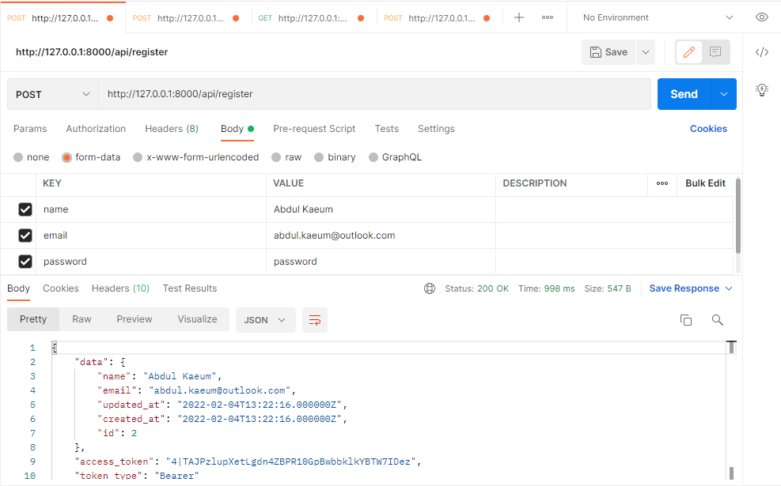
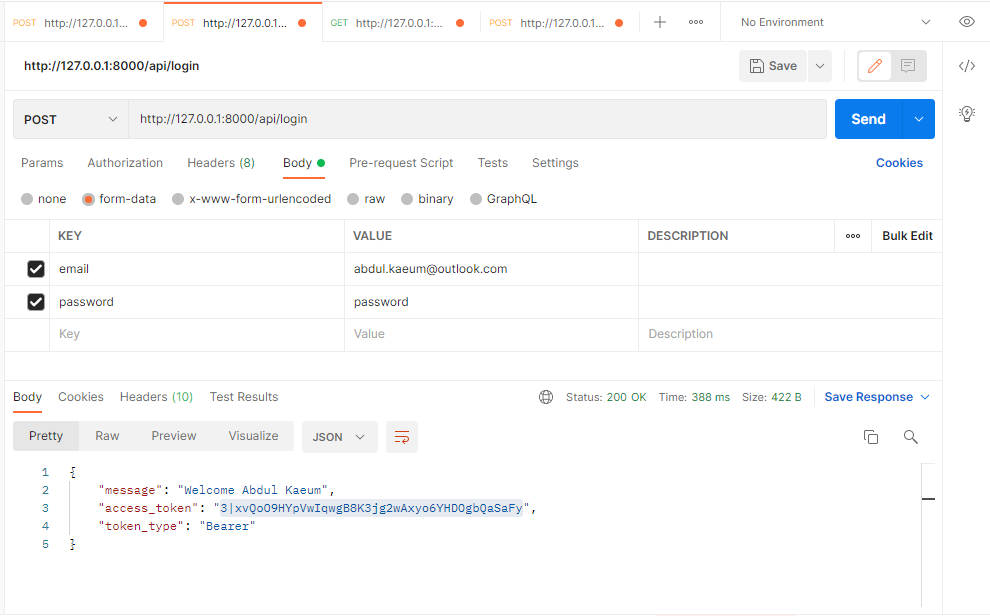
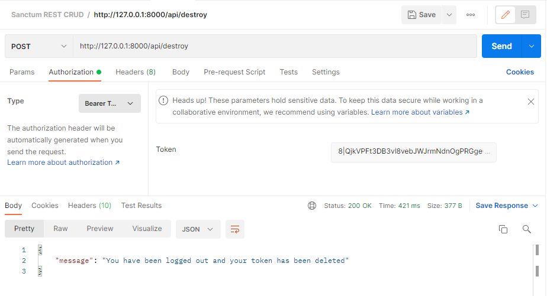
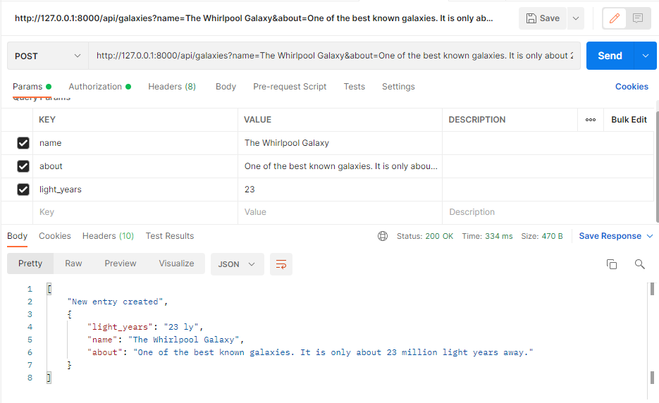
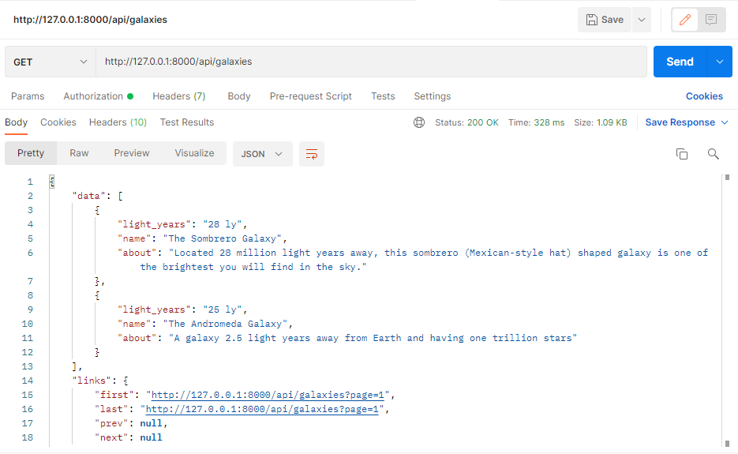
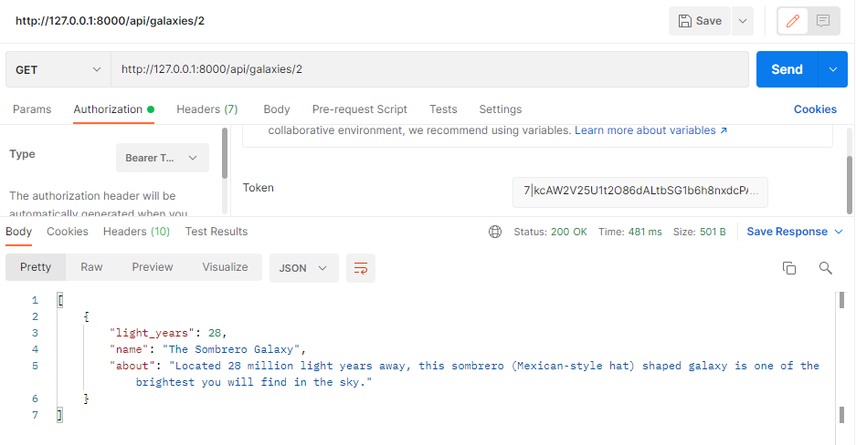
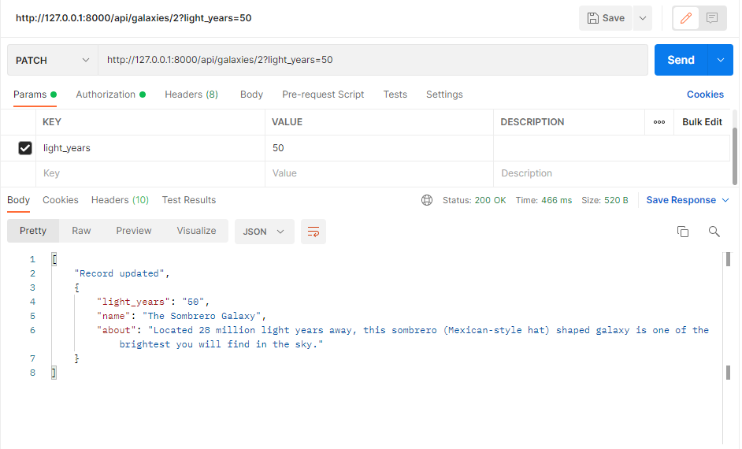
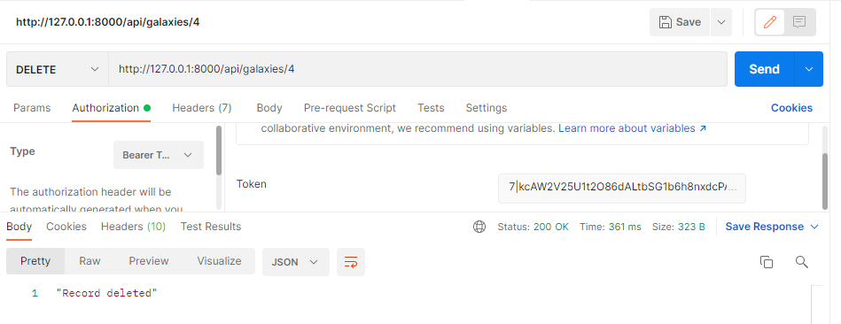

# Laravel 8: CRUD REST API with Authentication using Sanctum

Sanctum is a lightweight package that offers to create API tokens for users to interact with your application.
Tokens can be given roles / abilities forcing the user to perform restricted tasks.
Sanctum is available with Laravel 7+

## Features

- Register user + their token
- Login + their token
- Log out + destroy all user tokens

## Screenshots

- Register

- Login

- View Profile

- Sign out

- Store new resource 

- Show paginated resource

- Show a resource

- Update a single resource

- Destroy a resource

